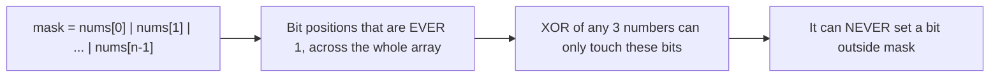
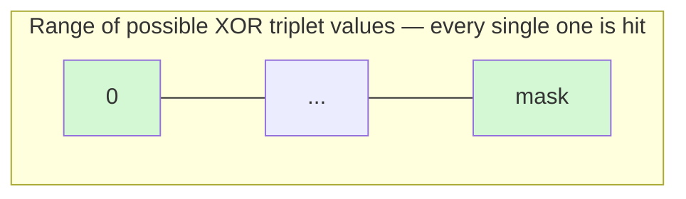

# 3513. Number of Unique XOR Triplets I
**Difficulty:** Medium
**Link:** https://leetcode.com/problems/number-of-unique-xor-triplets-i/
**Topics:** Array, Bit Manipulation, Math

---

## 📜 Problem Statement

You're given `nums`, a permutation of `[1, n]`. A **XOR triplet** is defined as:

```
nums[i] XOR nums[j] XOR nums[k],  where i <= j <= k
```

Return the number of **unique** values obtainable this way.

### Example 1
```
Input:  nums = [1, 2]
Output: 2
```
| (i, j, k) | Value |
|-----------|-------|
| (0,0,0)   | 1^1^1 = 1 |
| (0,0,1)   | 1^1^2 = 2 |
| (0,1,1)   | 1^2^2 = 1 |
| (1,1,1)   | 2^2^2 = 2 |

Unique values → `{1, 2}` → **Output: 2**

### Example 2
```
Input:  nums = [3, 1, 2]
Output: 4
```
Unique values → `{0, 1, 2, 3}` → **Output: 4**

### Constraints
- `1 <= n == nums.length <= 10^5`
- `1 <= nums[i] <= n`
- `nums` is a permutation of `[1, n]`

---

## 🧠 Intuition

The naive read: try all `O(n³)` triplets. With `n ≤ 10⁵`, that's not happening — we need to stop counting *triplets* and start reasoning about *which values are even reachable*.

### Step 0 — What does `i <= j <= k` actually let us pick?

Since `i, j, k` are **indices**, and `nums` is a permutation (every value appears exactly once), picking the same index twice just means "reuse this value." That collapses into two cases:

```
Case A — all 3 indices distinct  →  a ^ b ^ c   (3 genuinely different values)
Case B — 2 or 3 indices equal     →  x ^ x ^ y = y     (repeats cancel out, since x^x = 0)
                                      x ^ x ^ x = x
```

So the **entire reachable set** is just:
```
{ every single element itself }   ∪   { a ^ b ^ c : a, b, c are 3 DISTINCT elements }
```
That's the whole problem, reduced. Now we just need to figure out how big that second set is.

### Step 1 — Every element is free
From Case B: picking `i=j=k` (or two equal) always returns some `nums[x]` untouched. So **all `n` original numbers are guaranteed to be in our answer set**, at zero cost.

### Step 2 — The powers of two are hiding in plain sight
Here's the key fact that unlocks everything: since `nums` is a permutation of `1..n` (not just *some* array — a **contiguous run starting at 1**), every power of two up to the highest bit of `n` is *individually present as an element*:

```
1, 2, 4, 8, 16, ... , 2^b   all literally sit inside nums, as long as 2^b <= n
```

This matters because in XOR-land, powers of two are exactly the **basis vectors** — they're the "atoms" that build every other number. Having them all present as real array elements (not just as bits within bigger numbers) is what gives us the freedom to construct arbitrary values.

### Step 3 — XOR can't invent a bit outside `mask`

Think of `mask` as a hard ceiling. Whatever combination we XOR together, the result is trapped inside `[0, mask]`. So `mask` is an **upper bound** on how many unique values we could ever get — the real question is whether we hit *every* value in that range, or just some of them.

### Step 4 — Why `mask` is always a clean "all 1s" number
Because `nums` contains every integer `1..n` with no gaps, `mask = OR(1, 2, ..., n)` always comes out to a number of the form `2^(b+1) - 1` (binary `111...1`), where `2^b` is the highest power of two `≤ n`. A few examples:

| n | binary values present | mask | mask (binary) |
|---|---|---|---|
| 3 | 01, 10, 11 | 3 | `11` |
| 4 | 001, 010, 011, 100 | 7 | `111` |
| 6 | up to 110 | 7 | `111` |
| 8 | up to 1000 | 15 | `1111` |

Notice: `mask` is **never** a jagged number like `1011` — it's always a full run of 1-bits. That's a direct consequence of the array being a *permutation*, not an arbitrary set of numbers.

### Step 5 — Worked example: n = 4, nums = [1,2,3,4]
`mask = 1|2|3|4 = 7`, so we're claiming all of `{0,1,2,3,4,5,6,7}` are reachable. Elements `1..4` cover `{1,2,3,4}` for free (Step 1). For the rest:

```
0 = 1 ^ 2 ^ 3   ← three distinct elements
5 = 2 ^ 3 ^ 4
6 = 1 ^ 3 ^ 4
7 = 1 ^ 2 ^ 4
```
Every value `5, 6, 7` (all *above* `n`) turns out to be reachable by combining the "leftover" top bit (`4 = 2²`, our basis element from Step 2) with some smaller value to patch in the remaining bits. That's the general mechanism: **use the basis power-of-two to control the top bit, and a second/third array element to fill in the rest** — and because the array is a dense, gapless run of integers, there's always a valid combination sitting somewhere inside it.

### Step 6 — Putting it together
This "always enough combinations available" property is a known combinatorial fact for permutations of `1..n` once `n ≥ 3`: **every integer in `[0, mask]` is reachable as a triplet XOR.** (It fails below `n=3` — see Step 7 — because you simply don't have a *third distinct* element to unlock Case A at all.)

So the count of unique values is exactly the size of that range:

```
Answer = mask + 1
```



### Step 7 — Why `n ≤ 2` is a separate case
With only 1 or 2 elements, **Case A is impossible** — you can never pick 3 *distinct* indices. You're stuck entirely in Case B, meaning the only reachable values are the elements themselves. That's why the formula `mask + 1` would actually overcount here (e.g. `n=2`, `nums=[1,2]`: `mask=3`, `mask+1=4`, but the real answer is `2` — you can never form `0` or `3` with just two values and no third distinct one to combine with). Hence the explicit guard: return `n` directly when `n <= 2`.

---

## ✅ Approach

| Case | What to do |
|------|-----------|
| `n <= 2` | Just return `n` — only the elements themselves are reachable (not enough elements for the "always hit everything" property to kick in) |
| `n >= 3` | Compute `mask = OR of all elements`, return `mask + 1` |

**Why `mask + 1` and not something more complex?**
Because `mask` is the largest reachable value (all reachable bits set), and every integer below it is *also* reachable once `n ≥ 3`. The range `[0, mask]` inclusive has exactly `mask + 1` integers — so that's our answer, no enumeration needed.

---

## ⏱️ Complexity

| | Complexity | Why |
|---|---|---|
| **Time** | `O(n)` | One linear pass to OR all elements together |
| **Space** | `O(1)` | Just a single running integer (`mask`) |

---

## 🔑 Pattern
**Bitmask reachability** — when a problem asks "how many *distinct* values can an XOR/OR/AND expression take," check whether the answer collapses to a clean range defined by the OR of all inputs, rather than needing to enumerate combinations.