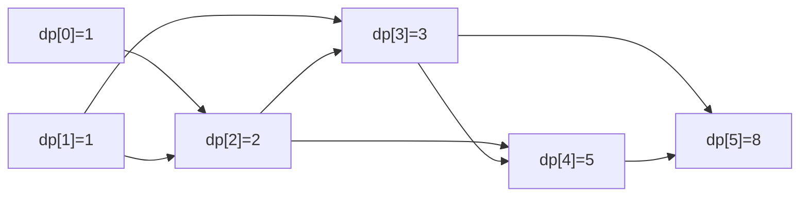

# 70. Climbing Stairs
**Difficulty:** Easy
**Link:** https://leetcode.com/problems/climbing-stairs/
**Topics:** Math, Dynamic Programming, Memoization

---

## 📜 Problem Statement

You're climbing a staircase with `n` steps. Each move you can climb either `1` or `2` steps. Return the number of distinct ways to reach the top.

### Example 1
```
Input:  n = 2
Output: 2       → [1+1], [2]
```

### Example 2
```
Input:  n = 3
Output: 3       → [1+1+1], [1+2], [2+1]
```

### Constraints
- `1 <= n <= 45`

---

## 🧠 Intuition

Ask yourself one question: **what was the very last move to reach step `n`?**

There are only two possibilities:
- The last move was a **1-step**, meaning you were previously at step `n-1`.
- The last move was a **2-step**, meaning you were previously at step `n-2`.

Every distinct path to step `n` falls into exactly one of these two buckets, and the buckets don't overlap. So:
```
ways(n) = ways(n-1) + ways(n-2)
```

That's it — that's the whole problem. It's the Fibonacci recurrence in disguise, discovered not by memorizing Fibonacci but by asking "what's the last decision?", which is the standard first move for *any* DP problem.

### Why this is DP and not just recursion
The naive recursive version:
```cpp
int ways(int n) {
    if (n <= 1) return 1;
    return ways(n-1) + ways(n-2);
}
```
works, but re-computes the same subproblems over and over — `ways(5)` calls `ways(3)` twice, `ways(2)` three times, and so on, blowing up to `O(2^n)`. The fix (the entire point of DP) is to notice these subproblems **overlap**, and cache each one's answer the first time it's computed — either top-down (memoization) or bottom-up (tabulation, what the submitted code does).

---

## ✅ Approach (Tabulation — bottom-up)

1. Create `dp[0..n]`, where `dp[i]` = number of ways to reach step `i`.
2. **Base case:** `dp[0] = 1` — there's exactly one way to be at the ground (do nothing).
3. **Transition:** for each `i` from `1` to `n`:
   ```
   dp[i] = dp[i-1] + dp[i-2]      (guarded so dp[i-2] is only added when i >= 2)
   ```
4. Return `dp[n]`.

This builds the answer from the ground up, so by the time you need `dp[i-1]` and `dp[i-2]`, they're already computed — no recursion, no repeated work.

---

## 🔍 Dry Run

**Input:** `n = 5`

| i | dp[i-2] contributes? | dp[i-1] contributes? | dp[i] |
|---|---|---|---|
| 0 | — | — | **1** (base case) |
| 1 | no (`i<2`) | dp[0]=1 | **1** |
| 2 | dp[0]=1 | dp[1]=1 | **2** |
| 3 | dp[1]=1 | dp[2]=2 | **3** |
| 4 | dp[2]=2 | dp[3]=3 | **5** |
| 5 | dp[3]=3 | dp[4]=5 | **8** |

`dp = [1, 1, 2, 3, 5, 8]` — recognize that sequence? It's Fibonacci, just shifted by one index. Answer for `n=5` is **8**.



---

## ⏱️ Complexity

| | Complexity | Why |
|---|---|---|
| **Time** | `O(n)` | Single pass building the `dp` array, `O(1)` work per step |
| **Space** | `O(n)` | The full `dp` array is stored |

### Optimization worth knowing
Since `dp[i]` only ever needs `dp[i-1]` and `dp[i-2]` — never anything further back — the whole array is unnecessary. You can collapse it to two rolling variables:
```cpp
int prev2 = 1, prev1 = 1;
for (int i = 2; i <= n; i++) {
    int curr = prev1 + prev2;
    prev2 = prev1;
    prev1 = curr;
}
return prev1;
```
This drops space to **`O(1)`** while keeping `O(n)` time — a standard next step once the `dp[]`-array version is understood. Worth implementing as a follow-up exercise before moving to harder DP problems, since "can I roll the array down to O(1) space" is a recurring question in this topic.

---

## 🔑 Pattern
**1D DP via "what was the last decision?"** The recurrence `dp[i] = dp[i-1] + dp[i-2]` shows up constantly once you frame problems this way — house robber, min cost climbing stairs, and tiling problems all reduce to a close variant of this exact structure. This is the canonical entry point into the `DP/` folder — most later problems are this same shape with an extra twist (a cost, a constraint, a different step size).